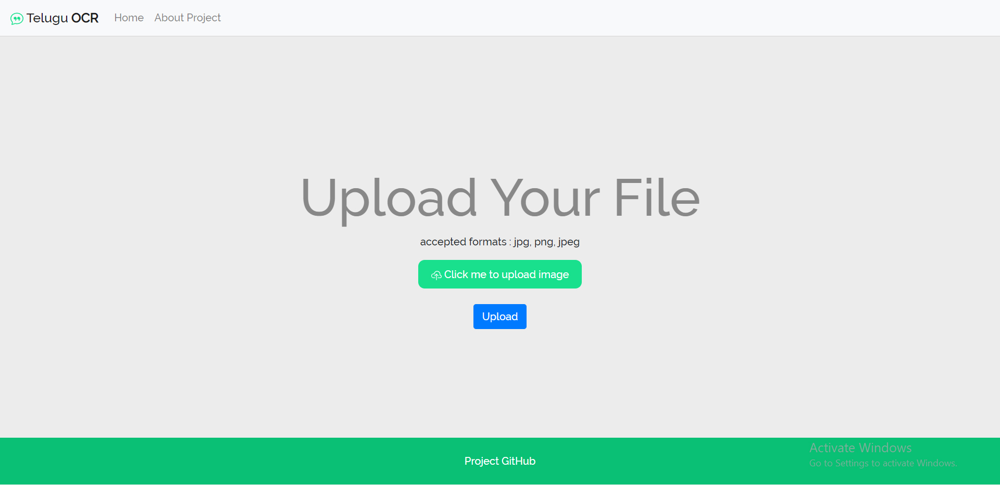
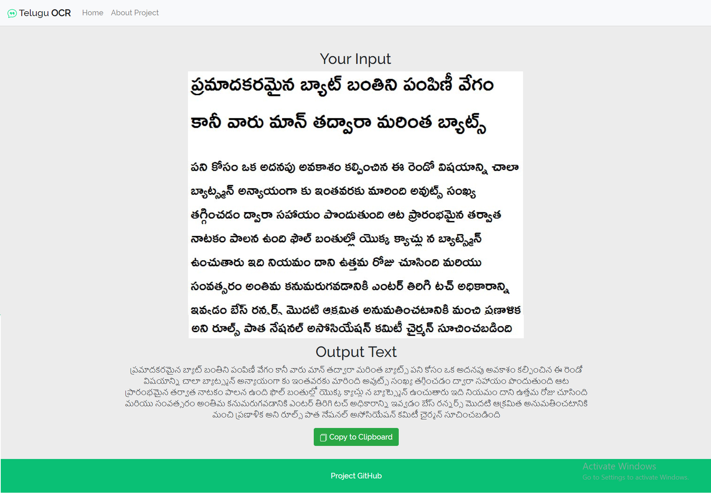

# Telugu-OCR
An API that change picture into a text for Telugu language. 
Main Language of the API is Python (Python 3.7) and the website is designed with HTML and CSS.

# Demonstration
Home Page


After Uploading an image that contains Telugu sentences 



# Usage

Create a virtual environment:
```
virtualenv env
```
You need to activate the virtual environment when you want to use it:
```
cd env/Scripts
activate
```

To fufil all the requirements for the python server, cd back to the main foler and run:
```
pip install -r requirements.txt
```
And finally 
```
python main.py
```
# Libraries

Flask
Jinja2
Tesseract
